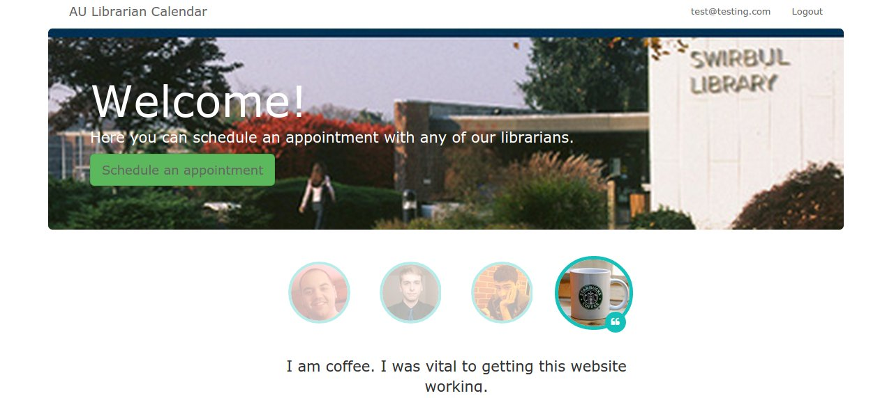

# Adelphi Library Calendar App

This web application made with *Ruby on Rails* will allow Adelphi University Students to schedule appointments with our librarians.  

###Features

- Functional registration and logins

- Appointment scheduling is connected to our *Appointment Database*

- Coming soon: *Google Calendar* integration.  We have the authentication set up, we just need to add the API calls.

- Coming soon: *eCampus* login integration
    
###Technologies Used
- Ruby on Rails
- Git + Github
- MySQL
- HTML + CSS + JavaScript/jQuery
- Bootstrap
- Google Calendar API
